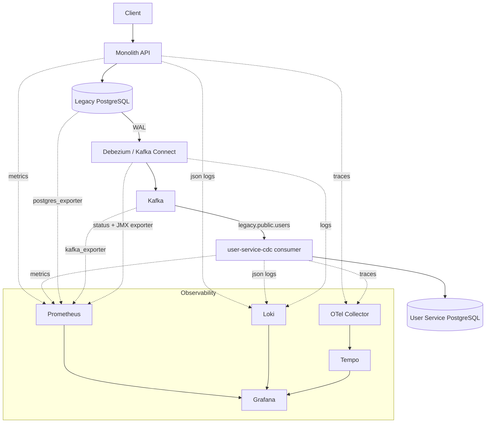

# observability-infrastructure

Metrics + Logs + Traces for the Strangler Fig migration lab
(`monolito-microservice`, `user-service`, `sales-service`, `cdc-infrastructure`).

This repo owns no business data. It only scrapes/reads the other containers
over the shared `migration-network` (created once by the other repos).

## Architecture



**Metrics** → Prometheus → Grafana
**Logs** → Promtail (discovers all lab containers via the Docker socket) → Loki → Grafana
**Traces** → OpenTelemetry SDK → OTel Collector → Tempo → Grafana

### The trace break at the WAL (read this before expecting one continuous trace)

An OpenTelemetry trace started by an HTTP request to the monolith ends when
that request's Postgres transaction commits. Debezium reads the WAL, not
in-process context, so the `trace_id` **cannot** propagate across
`Postgres → Debezium → Kafka → consumer` - there is no continuous, single
trace end-to-end, and this stack does not fabricate one.

What you get instead, and it is real:
- A real trace for `HTTP request → Postgres` in the monolith.
- A real, separate trace for `Kafka consume → apply → DB commit` in
  `user-service-cdc` (a new root span per message).
- Correlation between the two via **metadata**, not trace propagation:
  `topic`, `partition`, `offset`, `op`, `source.ts_ms`, and the entity id
  (e.g. `user_id`), all present in the structured JSON logs (never as a
  Prometheus label). Search Loki for `user_id=109` to see both the write in
  the monolith and its application in the consumer.

**Future evolution** (not implemented - would require a business-schema or
architecture change): the Outbox Pattern, where the monolith writes its
current `trace_id`/`span_id` into an outbox row alongside the business
change. Debezium would then carry that id through to the consumer, giving a
truly continuous trace. Out of scope for this lab.

## How to bring it up

Prerequisites: `migration-network` already exists (it does, created by the
other repos), and monolito-microservice / user-service / sales-service /
cdc-infrastructure are already running with their observability changes
applied (see each repo's own docker-compose.yml diff).

```bash
cp .env.example .env   # defaults already match the other repos' lab credentials
docker compose up -d
```

Dashboards, datasources, and alert rules are all provisioned as code - nothing
to click through in the UI after `up -d`.

## URLs

| Tool | URL | Notes |
|---|---|---|
| Grafana | http://localhost:3000 | dashboards under folder "Migration Lab" |
| Prometheus | http://localhost:9090 | also browse `/alerts` for rule state |
| Loki | http://localhost:3100 | usually accessed through Grafana, not directly |
| Tempo | http://localhost:3200 | usually accessed through Grafana, not directly |
| OTel Collector | http://localhost:4317 (gRPC) / :4318 (HTTP) | OTLP ingest |

## Grafana credentials

Lab-only, plaintext, **not for anything resembling production**:
- user: `admin`
- password: `admin` (from `.env`, `GRAFANA_ADMIN_PASSWORD`)

## Dashboards (provisioned automatically)

1. **Monolith → Microservices | Overview** - open this first. The whole
   pipeline's health (UP/DOWN per hop, both the users and sales branches)
   plus throughput/lag/latency headlines.
2. **CDC | Debezium & WAL** - connector/task state, WAL lag on
   `legacy_cdc_slot`, Debezium record counters (best-effort, needs JMX - see
   below). Covers both `legacy.public.users` and `legacy.public.sales` (one
   shared connector/task).
3. **Kafka | Migration Pipeline** - broker health, topic throughput, producer
   vs. consumer offset, lag by partition, for both the `user-service-cdc`
   and `sales-service-cdc` consumer groups.
4. **CDC Consumer** - every consumer-side counter and latency percentile
   (processing, DB commit, end-to-end). Parametrized by a `$consumer_service`
   variable (`user-service-cdc` / `sales-service-cdc`) - one dashboard, not
   duplicated per consumer.
5. **Migration | PostgreSQL** - legacy / user-service / sales-service
   Postgres side by side.
6. **Migration | Logs & Traces** - per-component log panels (monolith,
   Debezium/Connect, both HTTP services and both CDC consumers) with
   trace_id/request_id search, and log↔trace jump links.
7. **User CDC | End-to-End** - the demo dashboard: watch a
   CREATE/UPDATE/DELETE flow through the users pipeline live. (Sales has the
   same story visible via dashboards 1/3/4 together - a second near-identical
   demo dashboard was not added to avoid duplication.)
8. **API Gateway | Overview** - Kong (`api-gateway` repo): gateway and
   Admin API UP/DOWN, where each route points right now, Kong's health check
   of every backend, req/s by route → upstream, 2xx/4xx/5xx, p50/p95/p99,
   upstream latency, gateway overhead, and the JSON access log from Loki.
9. **API Gateway | Strangler Routing** - the didactic view
   (CLIENT → KONG → `/users` / `/sales` → monolith or microservice): the
   current destination of every route, the traffic share per destination,
   and a "route on monolith?" timeline where every step is a switch or rollback.

The *Overview* dashboard also has gateway tiles (API GATEWAY, `/users ->`,
`/sales ->`).

Gateway scrape jobs: `api-gateway` (`api-gateway:8100/metrics`, Kong's
Prometheus plugin on the Status API) and `gateway-route-exporter`
(`gateway-route-exporter:9542`, the configured route → upstream mapping).
The `api-gateway` job deliberately has **no static `service` label**: in
Kong's metrics `service` is the upstream that received the request. Kong
access logs reach Loki through Promtail (`compose_project="api-gateway"`),
with `route`, `upstream`, `status`, `request_id` and `trace_id` as JSON
fields, never labels. Kong's `opentelemetry` plugin sends spans to the OTel
Collector (`service.name=api-gateway`), so HTTP traces start at the gateway.

## Alert rules

Defined in `prometheus/rules/migration-lab-alerts.yml`, visible under
Prometheus → Alerts and Grafana → Alerting. No Alertmanager/Slack/email is
wired up in this lab - rules fire and are visible, nothing pages anyone:

`MonolithDown`, `LegacyPostgresDown`, `KafkaDown`, `KafkaConnectDown`,
`DebeziumConnectorFailed`, `ReplicationSlotInactive`, `HighWalLag`,
`CDCConsumerDown`, `DestinationDatabaseDown`, `HighConsumerLag`,
`CDCProcessingErrors`, `HighCDCEndToEndLatency`, and for the API Gateway
`ApiGatewayDown`, `ApiGatewayUpstreamUnhealthy`, `ApiGatewayHigh5xxRatio`,
`ApiGatewayRouteStateUnknown`.

The last five are generalized (one rule, `job=~"user-service-cdc|sales-service-cdc"`
or equivalent) rather than duplicated per consumer - each still fires as a
distinct alert instance labeled with the specific `job`/`service` that
triggered it (e.g. `CDCConsumerDown{job="sales-service-cdc"}`).

## The Debezium JMX exporter is best-effort

`debezium-jmx-exporter` gives you Debezium/Connect *internal* metrics
(records read/written, batch size). It requires `JMXPORT`/`JMXHOST` on the
`connect` service in `cdc-infrastructure` (already added there). If this one
container can't reach JMX for any reason, only the "best-effort" panels in
the CDC/Debezium dashboard go empty - connector RUNNING/FAILED status
(`connect-status-exporter`, via the REST API) and every consumer-side metric
keep working regardless.

## How to test the pipeline

The monolith API only exposes CREATE + read for both `users` and `sales` (no
UPDATE/DELETE endpoints - that's the monolith's own design, not a limitation
of this stack). CREATE via the API; exercise UPDATE/DELETE with direct SQL
against the legacy database, which is exactly how Debezium sees any change
regardless of how it was made:

```bash
# users
curl -X POST http://localhost:8000/users -H "Content-Type: application/json" \
  -d '{"name": "Observability Test"}'   # note the returned id
docker exec monolito-microservice-postgres-1 psql -U postgres -d monolith \
  -c "UPDATE users SET name = 'Observability Test Updated' WHERE id = <id>;"
docker exec monolito-microservice-postgres-1 psql -U postgres -d monolith \
  -c "DELETE FROM users WHERE id = <id>;"

# sales
curl -X POST http://localhost:8000/sales -H "Content-Type: application/json" \
  -d '{"user_id": 1, "item_name": "Observability Test", "quantity": 1}'   # note the returned id
docker exec monolito-microservice-postgres-1 psql -U postgres -d monolith \
  -c "UPDATE sales SET quantity = 99 WHERE id = <id>;"
docker exec monolito-microservice-postgres-1 psql -U postgres -d monolith \
  -c "DELETE FROM sales WHERE id = <id>;"
```

Then in Grafana:
- **User CDC | End-to-End**: watch "Events Consumed"/"Events Applied" tick up
  (users only).
- **Migration | Logs & Traces**: search `user_id=<id>` or `sale_id=<id>` to
  see the write in the monolith and its application in the consumer.
- **CDC Consumer**: pick `user-service-cdc` or `sales-service-cdc` in the
  `$consumer_service` variable and watch the counters/latency panels move.

`scripts/health-check.sh` gives the one-shot text summary of the whole lab.

## How to shut down

```bash
docker compose down       # safe - always use this
```

**Never** run `docker compose down -v` here, or in `cdc-infrastructure`,
`user-service`, or `sales-service`: it deletes `kafka_data` (Kafka's own log
segments and Connect's `_connect_offsets`/`_connect_configs`/`_connect_status`
topics) or the Postgres data volumes, which would lose the CDC pipeline's
resume position or your application data. `-v` on
**observability-infrastructure only** is safe if you explicitly want to wipe
Grafana/Prometheus/Loki/Tempo's own history (dashboards stay - they're
provisioned from files, not the volume) - but there is normally no reason to.

## What is intentionally not here

- No Alertmanager routing (Slack/email/PagerDuty) - out of scope for a lab.
- No multi-broker Kafka, no HA for any observability component.
- No dedicated dashboard/exporter for `migration-tool` - it's a one-shot CLI
  with no long-running container; its structured JSON logs would already be
  Loki-ingestible if it were ever run inside a container on this Docker host.
- `sales-service-cdc` (added 2026-09-22) shares every dashboard/alert with
  `user-service-cdc` via parametrization/label regex rather than duplicated
  panels/rules - see dashboard 4 ("CDC Consumer") and the alert rules note
  above.

## CI

| Workflow | Job | What it proves |
|---|---|---|
| `ci.yml` | **Lint** | ShellCheck, Ruff (connect-status-exporter), Hadolint |
| | **Validate Configs** | every config checked by its own binary at the compose version: `promtool check config/rules`, `loki -verify-config`, `promtail -check-syntax`, `otelcol validate`, Tempo boot (`/ready`), Grafana boot with the real provisioning (all dashboards + the 3 datasources must load) |
| | **Build** | exporter image (non-root) + Trivy image scan, `docker compose config` |
| `security.yml` | **Security** | Gitleaks, Bandit, pip-audit (exporter), Trivy config (SARIF). Also weekly. |

The whole stack with real telemetry is exercised by the full E2E run in `migration-e2e-tests`.
